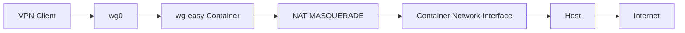
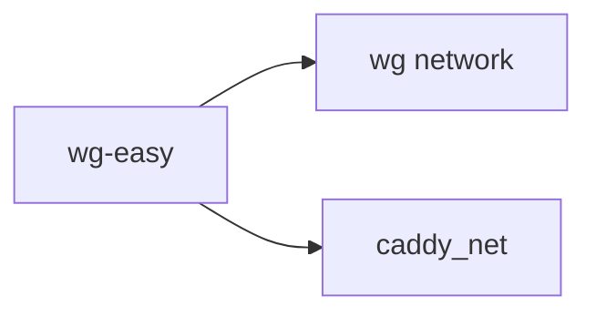
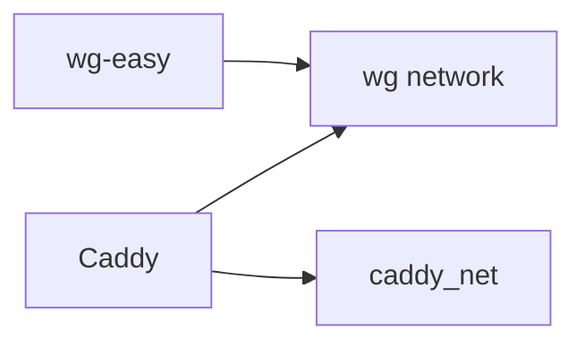

[[10_Foundations/vpn/ws-easy]]

## Symptom

```text
WireGuard connects successfully
Handshake works
But client has no Internet access
```

---

## Mental Model



When Internet doesn't work, determine **which hop is broken**.

---

# Step 1: Verify the tunnel itself

### Command

```bash
docker exec wg-easy wg show
```

### What it does

Shows active peers, handshakes, and traffic.

### Healthy output

```text
latest handshake: 10 seconds ago
transfer: 100 KiB received, 50 KiB sent
```

### If no handshake

Problem is:

```text
Client ↔ Server connectivity
UDP 51820
Firewall
Endpoint
```

Stop here and fix that first.

---

# Step 2: Verify server can reach client

### Command

```bash
docker exec wg-easy ping -c 3 10.8.0.2
```

### What it does

Tests server → client communication through the tunnel.

### Healthy output

```text
3 packets transmitted
3 received
```

### If it fails

Tunnel/routing issue.

### If it succeeds

Tunnel is working.

---

# Step 3: Verify container has Internet

### Command

```bash
docker exec wg-easy ping -c 3 8.8.8.8
```

### What it does

Tests whether the container itself can reach the Internet.

### Healthy output

```text
3 packets transmitted
3 received
```

### If it fails

Container networking issue.

### If it succeeds

Continue.

---

# Step 4: Find actual Internet interface

### Command

```bash
docker exec wg-easy ip route get 8.8.8.8
```

### What it does

Asks Linux:

> Which interface will you use to reach the Internet?

### Example output

```text
8.8.8.8 via 10.42.42.1 dev eth1
```

Important part:

```text
dev eth1
```

That is the actual outbound interface.

---

# Step 5: Inspect NAT rule

### Command

```bash
docker exec wg-easy grep MASQUERADE /etc/wireguard/wg0.conf
```

### What it does

Shows the NAT rule generated by wg-easy.

Example:

```text
-o eth0 -j MASQUERADE
```

---

# Step 6: Compare route vs NAT

Example:

```text
Internet route -> eth1
MASQUERADE    -> eth0
```

❌ Problem found.

The NAT rule is attached to the wrong interface.

---

# Step 7: Confirm using packet counters

### Command

```bash
docker exec wg-easy iptables -t nat -L POSTROUTING -n -v
```

### What it does

Shows NAT rules and hit counters.

Example:

```text
0 packets 0 bytes
MASQUERADE ... -o eth0
```

### Interpretation

If clients are actively browsing and counters remain:

```text
0 packets
```

then that rule is never matching.

This was the smoking gun in your case.

---

# Possible Error due multiple networks on ws-easy container 

Original design:



Two Docker networks in docker-compose file of ws-easy created two interfaces:

```text
eth0
eth1
```

wg-easy assumed:

```text
eth0 = Internet
```

but on this server:

```text
eth1 = Internet
```

So NAT never matched.

---

# Better Architecture

Current design:



Declare wg network in caddy docker compose file instead of caddy_net in wg-easy docker compose file.

Keep wg-easy on a single network.

Benefits:

```text
No eth0/eth1 ambiguity
Predictable routing
Predictable NAT
```

---

