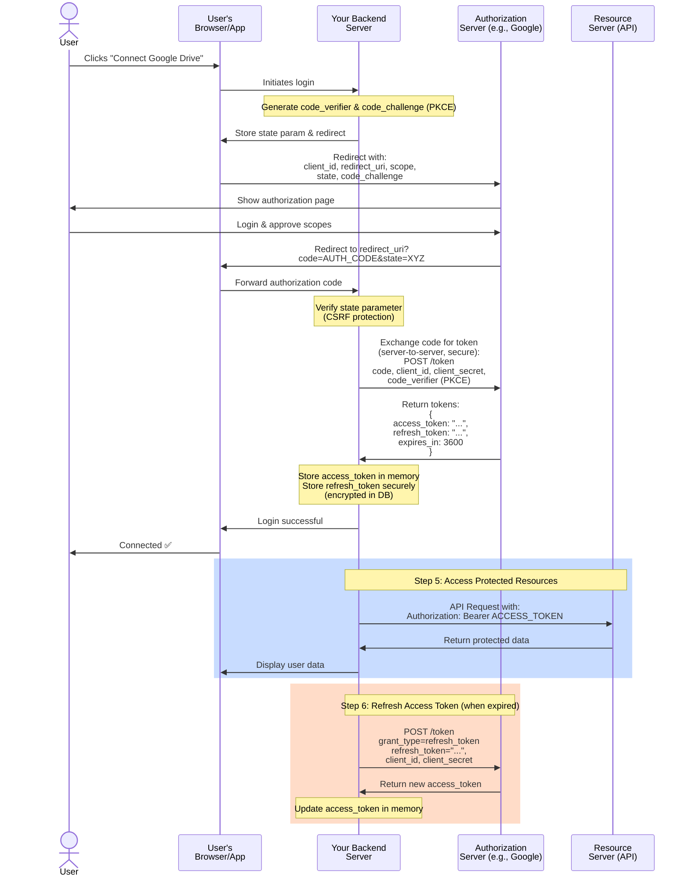

> This is most widely used and highly secure flow in OAuth 2.0

Used by backend web apps.

Flow:

1. Redirect user to authorization server
2. User logs in and consents
3. App receives authorization code
4. Backend exchanges code for access token

👉 Recommended flow today.

---


## 1. App registers with service provider
- App registers Redirect URI and obtains `client_id` (and `client_secret` for confidential backend apps) with the service-provider's authorization server
- For public clients (SPA, mobile), app prepares [[OAuth 2.0 - Authorization Flow with PKCE]]  values: `code_verifier` and `code_challenge`

## 1. User asks app to link to a service
- User (in browser) clicks "Connect" in the app UI
   - Suppose user needs to store some data from app to Google Drive (service-provider), so he clicks 'Connect Google Drive'
- Browser → App (frontend): action to start OAuth flow.
- App (frontend or backend) prepares an authorization request includeing:
   - `response_type=code`
   - `client_id=...`
   - `redirect_uri=https://app.example.com/callback` - this value must match with registered redirect_uri on authorization server by app
   - `scope=...`
   - `state=RANDOM_STRING` for CSRF protection
   - `code_challenge=HASH(code_verified)` if using PKCE

## 2. App redirects user to service's **Authorization Endpoint** on Authorization server

- Browser is redirected to the service-provider's authorization endpoint:
   ```
   GET /authorize?response_type=code&client_id=...&redirect_uri=...,etc
   ```
- The Login/Authorization page is hosted entirely by the service provider
- In this Authorization Page, User submit credentials and approves requested scopes (he sees scope on UI) 

👉 This is called delegated authorization

### Scopes

App includes **scopes** (permissions to access resources) in the Authorization request.
You request scopes during login:
```
scope=openid profile accounting.transactions
```
	
Scopes define permissions, like:
```
openid profile email accounting.transactions
```

Scopes are **decided at authorization step**
Scopes are attached: Authorization Code, Access Token, Refresh Token
- Tokens **inherit scopes**, not choose them

## 3. After service's Authorization server gets approval from user, it sends **Authorization Code** to App's server

- After user's approval on authorization page, Authorization server redirects the browser back to the app's redirect URI
   - `https://app.example.com/callback?code=AUTH_CODE&state=RANDOM`
- Browser forwards the authorization code to the app's backend
   - Browser → App(frontend): receives the redirect and forwards the `code`
   - App(frontend) → App(backend): `POST /callback` (or similar) with `code` and `state`
   - App(backend) validates the `state` value to prevent CSRF


### Authorization code

Authorization Code
- Lives for ~30–60 seconds
- Cannot access APIs directly
- Used only once
- You **exchange it for tokens** (access + refresh)

Service's Authorization server calls App's backend to send authorization code:
```curl
https://yourapp.com/callback?code=AUTH_CODE
```

###  PKCE (Proof Key for Code Exchange)

👉 **Problem it solves:**
Without PKCE, if someone steals the **authorization code**, they can exchange it for tokens.

👉 **Solution:**
PKCE adds a **secret verifier** only your app knows.

---

### 🔁 PKCE Flow (simplified)

1. Generate:
   - `code_verifier` (random string)
   - `code_challenge = hash(verifier)`

2. Send:
```
code_challenge=XYZ
```

3. After login, you get `authorization_code`

4. When exchanging:
```
code_verifier=original_secret
```
   
5. Server checks:
```
hash(verifier) == code_challenge
```

👉 If match → tokens issued
👉 If not → rejected

---

### Why PKCE matters:

- Prevents **authorization code interception attacks**
- Mandatory for:
	- SPAs (React, Next.js frontend)
	- Mobile apps


## 4. App's server sends request to service's Authorization server with Authorization-code and get Access-Token and Refresh-Token in response

- App(backend) → Service-provider's token endpoint: `POST /token` with:
   - `grant_type=authorization_code`
   - `code=AUTH_CODE`
   - `redirect_uri=https://app.example.com/callback`
   - `client_id=...`
   - `client_secret=...` (for confidential clients) OR `code_verifier=...` (for PKCE)
- This is a direct server-to-server call (no browser redirect)
- Service-provider's authorization server → App(backend): JSON {`access_token`: "...", `refresh_token`: "...", `expires_in`: N, `scope`: "..."}
- App(backend): 
   - stores `access_token` in memory/cache for short-term use
   - stores `refresh_token` encrypted in database
   - uses `Authorization: Bearer ACCESS_TOKEN` when calling the resource server on behalf of the user
- When `access_token` expires:
   - App(backend) → service-provider's token endpoint: POST /token with `grant_type=refresh_token`, `refresh_token=...`, `client_id` and `client_secret` (if required)
   - Authorization server returns a new `access_token` (and sometimes a new `refresh_token`)


### Why not directly return Access + Refresh Token instead of Authorization Code?

#### Problem if tokens are returned directly:

When redirecting back to your app:

```
https://yourapp.com/callback?access_token=XYZ
```

That token could leak via:

* browser history
* logs
* referer headers
* malicious scripts

#### Why Authorization Code is better:

Flow:

1. User logs in → server returns **authorization code**
2. Your backend exchanges it for tokens via **secure server-to-server call**

```
POST /token (with client_secret)
```

#### Key benefits:

* Tokens are **never exposed in browser**
* Requires **client_secret** → proves app identity
* Safer against interception


### Access Token

Store Access Token in **memory/cache**

Access Token is
- a **temporary credential** used to call APIs.
- Short-lived (**minutes to hours**)
- Sent with every API request
- If leaked → attacker can act as user (until expiry)

Access protected resources (e.g. storage of Google Drive)
```http
Authorization: Bearer ACCESS_TOKEN
```

### Refresh Token 

Store Refresh Token in **database** in encrypted-form

Refresh Token is:
- A **long-lived token** used to get new access tokens.
- When access token expires, instead of asking user to login again:
- Long-lived (days/months)
- Must be stored securely (server-side)
- Can generate new access tokens repeatedly

```
POST /token
grant_type=refresh_token
```

## 5. App sends Access Tokens with resources it need to **Resource server** and gets required data in response

### 6. Once Access Token is expired, App use Refresh Token to get new Access Token

---

## Complete OAuth 2.0 Authorization Code Flow Diagram



### Flow Diagram Legend:
- **State Parameter** → CSRF attack prevention
- **Code Verifier & Challenge** → PKCE security (especially for SPAs)
- **client_secret** → Proves app identity (kept secret on backend)
- **code** → Short-lived, single-use, secure code
- **access_token** → Short-lived credentials for API calls
- **refresh_token** → Long-lived, used to get new access tokens

