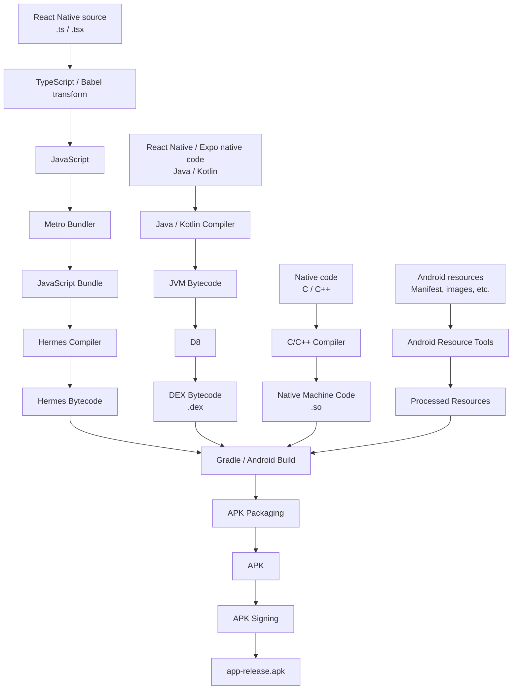
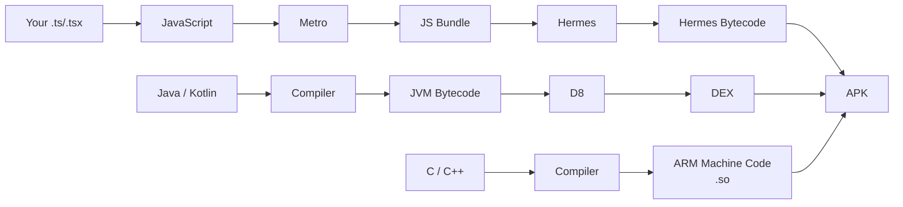

Metro is the JavaScript bundler used by React Native (Webpack in react).
Gradle is the build system that turns your Android project's source code and resources into an APK or AAB.
Hermes is javascript engine (V8 in Chrome-browser).
- Javascript → Hermes compiler → Hermes bytecode
- For a React Native Android app using Hermes, the Hermes engine is packaged as part of the APK (typically as a native .so library at `app.apk/lib/arm64-v8a/libhermes.so`)
Android SDK is set of Android APIs/tools needed to build the Android application
D8 converts JVM bytecode into DEX. DEX is bytecode designed for Android's runtime.
- Java/Kotlin → Java/Kotlin compiler → JVM Bytecode (`.class` files) -> D8 → `.dex`

