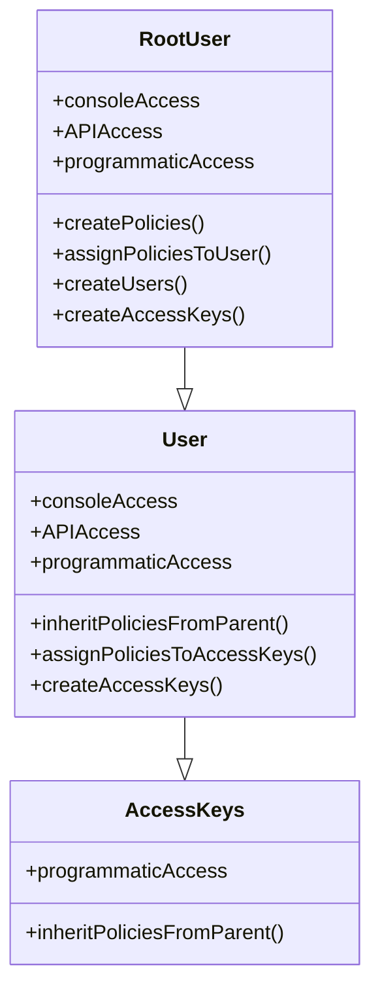

# minio implementation

### 1. start minio container

  ```yml
  services:
    minio:
      image: minio/minio:RELEASE.2025-02-07T23-21-09Z
      container_name: minio
      ports:
        # S3_endpoint for host: http://localhost:9000/
        # S3_endpoint for other docker containers: http://minio:9000/
        #   here in this url 'minio' is container_name
        - "9000:9000"
        # s3 ui dashboard
        - "9001:9001"
      volumes:
        # directory $HOME/minio/data will be mounted in container at /data, this will store all files uploaded to minio
        - ~/minio/data:/data
      environment:
        # credentials to login through ui at localhost:9001/
        - MINIO_ROOT_USER=ROOTNAME
        - MINIO_ROOT_PASSWORD=CHANGEME123
        
        
        # create bucket through ui: http://localhost:9001/
      command: server /data --console-address ":9001"  
  ```
### 2. setup environment

- create (access_key + secret_key) combination through ui: User -> Access Keys

- add related variables in .env file

  ```.env
  S3_ENDPOINT=http://localhost:9000
  S3_ACCESS_KEY=<generated-access-key/username>
  S3_SECRET_KEY=<generated-secret-key/password>
  S3_BUCKET_NAME="my-bucket"
  ```

### relationship between rootUser, user, accessKeys

- user (normal user or rootUser) can create accessKeys
- accessKeys only have programaticAccess
- user credentials can be used as accessKey(username) and secretKey(password)
- user credentials can be used for console-access(login to ui), api-access and programmaticAccess 



### cli usage
- create bucket
  - download and install [minio command line - mc](https://dl.min.io/client/mc/release/linux-amd64/)

  ```bash
  # set connection
  # mc alias set <custom-connection-name> <endpoint> <username> <password> 
  #    username and password here are set in docker-compose file above
  # this connection will be stored in ~/.mc/config.json
  mc alias set minio-admin http://localhost:9000 ROOTNAME CHANGEME123
  mc alias ls
  mc admin info minio-admin

  mc admin user add minio-admin user1 password1
  mc admin user ls minio-admin

  # give privalages to user
  # list policies
  mc admin policy list minio-admin
  # read specific policy
  mc admin policy info minio-admin readonly
  # attach policy to user; here are giving readwrite access to user1 for 'all buckets'
  mc admin policy attach minio-admin readwrite --user user1
  mc admin policy entities minio-admin --user user1
  # create user connection
  mc alias set conn1 http://localhost:9000 user1 password1
  # this will fail, as we given user readwrite access but not administrative access; this way we have created limited access user
  # now we can use this user-credentials as: S3_ACCESS_KEY, S3_SECRET_KEY
  mc admin info conn1 

  # create bucket
  # mc mb(make-bucket) <connection-name>/<bucket-name>
  mc mb conn1/bucket1
  # list buckets
  mc ls conn1
  # copy file to bucket
  mc cp ./file1.txt conn1/bucket1
  mc ls conn1/bucket1
  # put file in a folder
  # this folder structure is only better user-experience, in reality all files are in bucket-root with path-name as their identifier
  mc cp ./file2.txt conn1/bucket1/folder1
  # move file between buckets
  mc mv conn1/bucket1/file1.txt conn1/bucket2 
  ```


